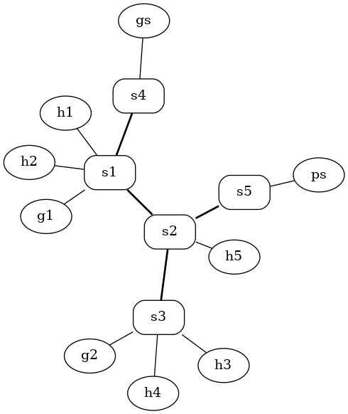

# On-Demand SDN Slices with QoS and Preemption

This project implements a dynamic network slicing system using the Ryu SDN controller and the ComNetsEmu emulator. It allows a network operator to create, activate, and deactivate isolated network "slices" on-demand via a simple command-line interface. Each slice is defined by specific traffic flows, a guaranteed bandwidth (QoS), and a priority level, enabling sophisticated traffic management.

## Key Features

-   **Dynamic Slice Management**: Activate and deactivate slices on-the-fly without network downtime using a REST API.
-   **Guaranteed QoS**: Enforces bandwidth guarantees for each slice using Linux Traffic Control (TC).
-   **Strict Traffic Isolation**: Slices are completely isolated from each other and from general network traffic using OpenFlow rules.
-   **Priority-Based Preemption**: High-priority slices can automatically preempt (deactivate) lower-priority slices if network resources are scarce.
-   **Admission Control**: The controller rejects slice activation if there is insufficient bandwidth, preventing over-commitment of resources.
-   **Live Status Monitoring**: A CLI command provides a real-time overview of active slices and link utilization.

## System Architecture

The system is composed of several interconnected components:

#### Core Logic
-   **`slicing_controller.py`**: The brain of the operation. This Ryu application manages the network topology, exposes a REST API for slice control, and dynamically installs OpenFlow rules to enforce slice policies (forwarding, isolation, QoS, and preemption).
-   **`topology.py`**: A ComNetsEmu script that builds the virtual network, including hosts, OpenFlow switches, and links with defined bandwidth capacities.
-   **`cli.py`**: A user-friendly command-line interface (CLI) for interacting with the controller's REST API. It simplifies the process of activating, deactivating, and monitoring slices.

#### Configuration & Dependencies
-   **`slices.yaml`**: A human-readable YAML file where all available network slices are defined. Each slice specifies its flows, required bandwidth, and priority.
-   **`requirements.txt`**: Lists the necessary Python dependencies for the project's user-facing scripts.

#### Supporting Scripts
-   **`queue_create.sh`** & **`queue_delete.sh`**: Bash scripts invoked by the controller to manage Linux Traffic Control (TC) queueing disciplines on switch interfaces, which are essential for enforcing bandwidth limits.

## Getting Started

### Prerequisites
Ensure the following are installed on your system (Ubuntu-based distribution recommended):
1.  **ComNetsEmu**: The network emulator.
2.  **Ryu SDN Controller**: The SDN controller framework.
3.  **Python 3** and `pip`.
4.  **Open vSwitch**.
5.  **Python Virtual Environment package**:
    ```bash
    sudo apt install python3-venv
    ```

### Installation

> **Note on Clean Installation:** If you are reinstalling or have encountered issues, it's a good practice to start with a clean slate. You can remove the old virtual environment directory before proceeding:
> `rm -rf env`

1.  **Clone the repository** or place all project files in the same directory.

2.  **Install System-Wide Dependencies for Ryu**: The Ryu controller runs as root and requires some packages to be installed at the system level.
    ```bash
    sudo pip install networkx PyYAML
    ```

3.  **Set up a Python virtual environment** for user scripts:
    ```bash
    python3 -m venv env
    source env/bin/activate
    ```

4.  **Install dependencies for the CLI**:
    ```bash
    pip install -r requirements.txt
    ```

5.  **Make the QoS scripts executable**:
    ```bash
    chmod +x queue_create.sh queue_delete.sh
    ```

## Topology created


## Execution

The project requires three separate terminals.

**Terminal 1: Start the Ryu Controller**
Run the controller with `sudo -E` to grant root privileges while preserving essential environment variables.
```bash
source env/bin/activate
sudo -E ryu-manager ryu.topology.switches slicing_controller.py
```
*Expected Output:* You should see logs indicating that the controller has started and the API server is running.
```
Controller started. Slices loaded: ['gaming', 'work', 'emergency', 'video']
API server started on http://0.0.0.0:8080
...
```

**Terminal 2: Start the Network Topology**
This command starts ComNetsEmu and opens its interactive CLI.
```bash
source env/bin/activate
sudo -E python3 topology.py
```
*Expected Output:* The topology will be built, and you will be dropped into the Mininet command-line interface.
```
*** Disabling IPv6 on all hosts
*** Running CLI (type exit to quit)
*** Starting CLI:
mininet>
```

**Terminal 3: Manage Slices via CLI**
Activate the virtual environment in this terminal to run the CLI script.
```bash
source env/bin/activate
./cli.py <action> [slice_name]
```

---

## Verification Scenarios

Once the controller and topology are running, perform these tests in the recommended order to verify all system functionalities. Each scenario builds upon a clean state unless specified otherwise.

### Scenario 1: Baseline L2 Connectivity
**Goal:** Confirm that the controller provides basic network-wide connectivity when no slices are active.

1.  **In the Mininet CLI (Terminal 2), run `pingall`:**
    ```
    mininet> pingall
    ```
2.  **Expected Outcome:** The test must succeed with `0% dropped`, showing that the controller's default L2 learning switch functionality is working.

---
### Scenarios 2 & 3: Slice Lifecycle (Activation and Deactivation)
**Goal:** Verify the complete lifecycle of a slice, from activation and isolation to deactivation and resource release. These two scenarios should be performed sequentially.

#### Part 1: Activation, Isolation, and QoS
1.  **Activate the `gaming` slice (Terminal 3):**
    ```bash
    ./cli.py activate gaming
    ```
2.  **Verify Connectivity (Terminal 2):** Ping between the hosts inside the slice.
    ```
    mininet> g1 ping gs
    ```
    *Expected Outcome:* The ping must succeed (`0% packet loss`).

3.  **Verify Isolation (Terminal 2):** Attempt to ping a host outside the slice.
    ```
    mininet> g1 ping h1
    ```
    *Expected Outcome:* The ping must fail (`100% packet loss`).

4.  **Verify QoS (Terminal 2):** Run an `iperf` test to measure the bandwidth.
    ```
    mininet> gs iperf -s &
    mininet> g1 iperf -c 10.0.0.8
    ```
    *Expected Outcome:* Bandwidth should be approximately **60 Mbits/sec**.

#### Part 2: Deactivation and Resource Release
1.  **Deactivate the `gaming` slice (Terminal 3):**
    ```bash
    ./cli.py deactivate gaming
    ```
2.  **Verify Isolation is Removed (Terminal 2):** The previously blocked ping should now work.
    ```
    mininet> g1 ping h1
    ```
    *Expected Outcome:* The ping must succeed. At this point, the network is back to a clean state.

---
### Scenario 4: Admission Control
**Goal:** Test that the controller rejects a new slice if there isn't enough bandwidth.

1.  **Activate `gaming` slice (60 Mbps) (Terminal 3):**
    ```bash
    ./cli.py activate gaming
    ```
2.  **Attempt to activate `video` slice (50 Mbps) (Terminal 3):**
    ```bash
    ./cli.py activate video
    ```
    *Expected Outcome:* The command must fail with a `409 Conflict` error.
3.  **Cleanup:** Deactivate the `gaming` slice to prepare for the next test.
    ```bash
    ./cli.py deactivate gaming
    ```

---
### Scenario 5: Priority and Preemption
**Goal:** Demonstrate that a high-priority slice can preempt a lower-priority slice.

1.  **Activate the medium-priority `gaming` slice (60 Mbps, Priority 50) (Terminal 3):**
    ```bash
    ./cli.py activate gaming
    ```
2.  **Attempt to activate the high-priority `emergency` slice (50 Mbps, Priority 100) (Terminal 3):**
    ```bash
    ./cli.py activate emergency
    ```
    *Expected Outcome:* The controller log (Terminal 1) will show a warning: `Preempting slices ['gaming'] to activate 'emergency'`, and the slice will be activated successfully.

3.  **Verify the preempted slice is inactive (Terminal 2):**
    ```
    mininet> g1 ping gs
    ```
    *Expected Outcome:* The ping must fail (`100% packet loss`), confirming the `gaming` slice has been deactivated.

4.  **Cleanup:** Deactivate the `emergency` slice.
    ```bash
    ./cli.py deactivate emergency
    ```

---
### Scenario 6: System Status Monitoring
**Goal:** Verify the real-time monitoring functionality.

1.  **Activate any slice, e.g., `work` (Terminal 3):**
    ```bash
    ./cli.py activate work
    ```
2.  **Request the system status (Terminal 3):**
    ```bash
    ./cli.py status
    ```
3.  **Expected Outcome:** The command will return a JSON object detailing active slices and link usage.
4.  **Cleanup:** Deactivate the `work` slice.
    ```bash
    ./cli.py deactivate work
    ```

---

## Cleanup

To exit the simulation, type `exit` in the Mininet CLI (Terminal 2).

Then, run the cleanup command in any terminal to remove any residual network configurations.
```bash
sudo mn -c
```
You can now close all terminals.

## Authors

-   Antonio Di Lauro, Raffaele Crocco
-   Networking, University of Trento, 2024
